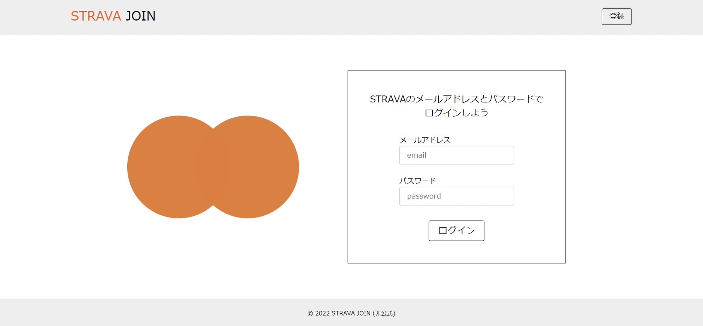
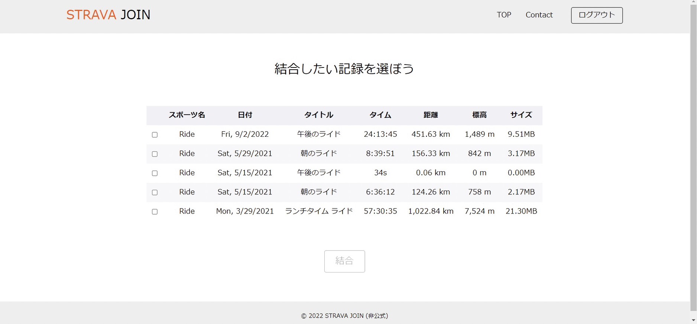
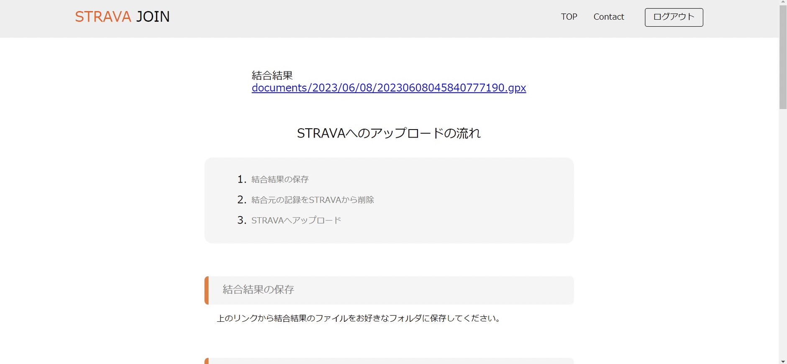

# stravajoinproject
## 注意点
ユーザーのStravaのアカウント情報をサイト内で用いるため、フィッシング詐欺と思えてしまうため、現在はサイトは閉鎖しております。

## 開発動機
Stravaというアプリで、複数のアクティビティを一つのアクティビティに結合したい場合がありますが、残念ながらStravaはそのようなサービスを提供していません。インターネット上には、アクティビティを結合する方法がたくさん紹介されていますが、これらはアクティビティの生のgpxコードを取得して編集する必要があり、非常に手間がかかります。

そこで、私は結合したいアクティビティを選択するだけで簡単に結合できるサービスを作成しました。

## サイトの使い方
### ①stravaのアカウントでloginします

### ②login情報をもとにStravaからアクティビティの情報を取得してきます

- アクティビティを二つ以上選択しないと結合ボタンは押せないようにしてあります
- 選択したアクティビティのファイルの合計サイズが25MB以上の場合、結合ボタンは押せないようにしてあります[^1].

[^1]:Stravaでは25MB以上のファイルをアップロードできないため

### ③結合したアクティビティをStravaにアップロード

- Stravaへのアップロードは手動で行います。なぜ自動化しないかというと、Stravaでは、同時期のアクティビティを持てないため、結合前のデータは削除しなくてはいけません。そのため、削除するかどうかはユーザーに任せることにしています。

## 制作環境（サーバー環境や使用ツール）と使用言語
- フロントエンド言語 (HTML,CSS,JavaScript)
- バックエンド言語 (Python)
- フレームワーク (Django)
- データベース (PostgreSQL)
- webサーバー (Nginx)
- クラウドサービス (AWS)

## なぜPythonなのか？
Stravaからアクティビティデータをスクレイピングする必要があるため、Pythonのようにウェブスクレイピングに役立つ豊富なライブラリやモジュールがある言語を使用することにしました。
